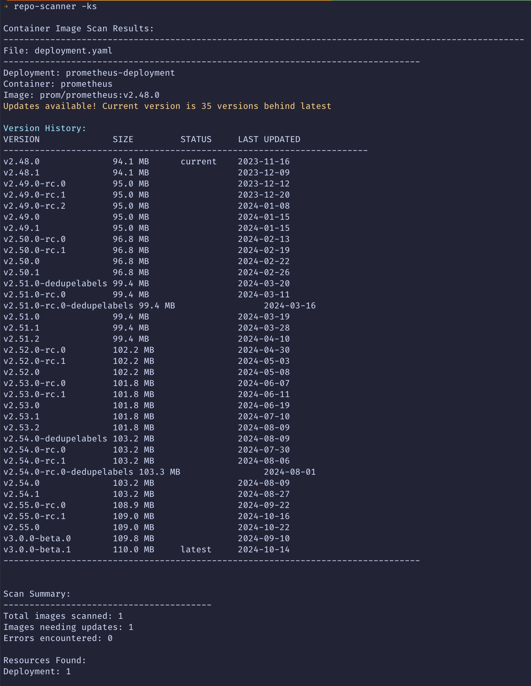

# repo-scanner

## Overview
- Recursively scans directory for Dockerfiles, YAML files and Kubernetes manifests
- Extracts container image references using regex
- Checks Docker Hub for updates for each image
- Presents results in formatted and coloured   output

## Key Features
- Concurrent update checking with rate limiting
- Supports both Dockerfile and YAML/YML files
- Comprehensive Kubernetes support:
  - Deployments, StatefulSets, DaemonSets
  - CronJobs and Jobs
  - Pods and ReplicaSets
  - Init containers support
  - Multiple containers per pod
- Grouped output by file for better readability
- Resource type and name display
- Container name display
- Color-coded output for better visibility
- Handles Docker Hub public images
- Shows last updated dates
- Identifies available updates
- Shows all versions between current and latest
- Includes version sizes
- Clearly marks current and latest versions
- Sorts versions using semantic versioning when possible
- Shows how many versions behind the current version is
- Includes last updated dates for each version
- Scanner now handles:
  - Semantic versioning (e.g., 1.2.3)
  - Date-based versions (e.g., 20240301)
  - Alpine/slim variants
  - Non-semver tags

## Installation
```bash
go install github.com/adegoodyer/repo-scanner/cmd/repo-scanner@latest
```

## Usage
```bash
# usage
repo-scanner
repo-scanner --kubernetes-only (-k) flag to only scan Kubernetes manifests
repo-scanner --show-summary (-s) flag for summary statistics
```

## Sample Output
```bash
Container Image Scan Results:
----------------------------------------------------------------------------------------------------
File: ./manifests/deployment.yaml
--------------------------------------------------------------------------------
Deployment: backend-api
Container: api
Image: golang:1.19

Updates available! Current version is 3 versions behind latest

Version History:
VERSION              SIZE         STATUS     LAST UPDATED
----------------------------------------------------------------------
1.19                 956.8 MB     current   2023-10-15
1.20                 968.2 MB               2023-12-20
1.21                 972.1 MB               2024-02-10
1.22.1               975.5 MB     latest    2024-03-15
--------------------------------------------------------------------------------

File: ./manifests/redis.yaml
--------------------------------------------------------------------------------
Deployment: cache
Container: redis
Image: redis:6.2

Updates available! Current version is 2 versions behind latest

Version History:
VERSION              SIZE         STATUS     LAST UPDATED
----------------------------------------------------------------------
6.2                  115.2 MB     current   2023-11-01
7.0                  117.8 MB               2023-12-15
7.2.4                119.1 MB     latest    2024-03-10
--------------------------------------------------------------------------------
```

## Screenshot
